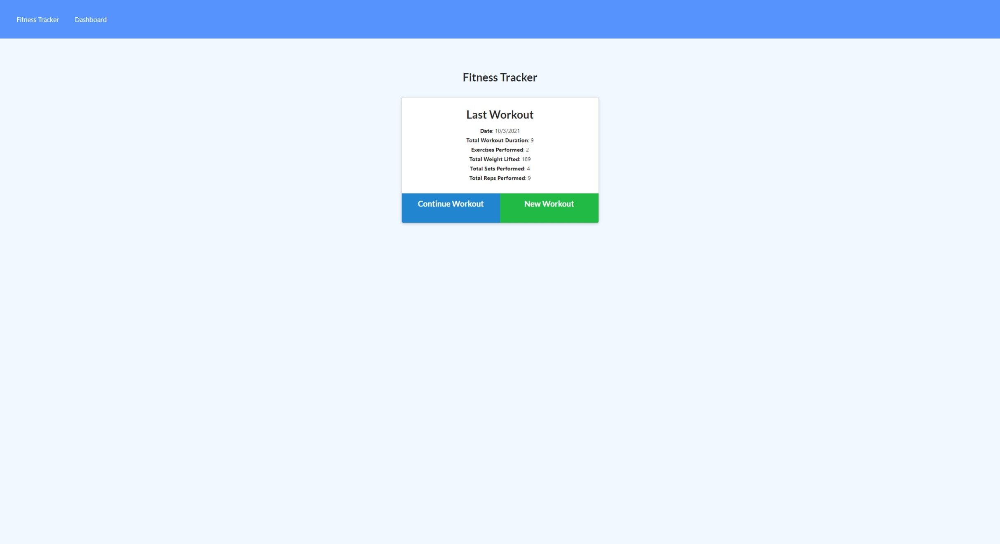
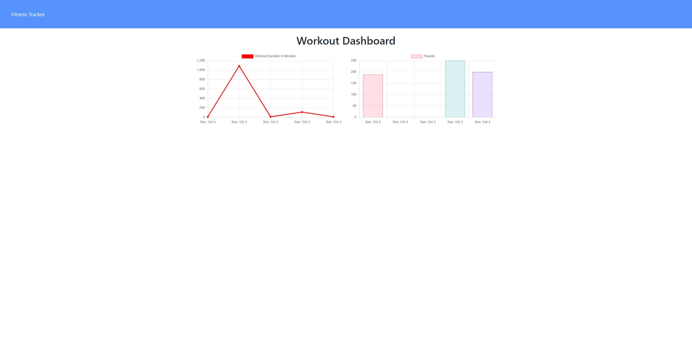

# fitness-tracker

## Description:

Fitness Tracker is a web app that allows a user to keep track of their workouts and see information about their last 7 workouts. the data that is provided gives them a accumulative amount of weight they have lifted and the duration of their workouts.

## Instructions:

Users can either create a new workout or update the current workout. After choosing to edit or create a new workout the user can add excercises by filling out the form on the website. After the user is done entering workouts they can complete the workout and the website will return to the main page which will display info about the users last workout. If the user clicks on the stats page they will see two graphs with information about their workouts.

## Website Info:
----------

https://guarded-woodland-06880.herokuapp.com/

## Questions
if you have any questions you can reach me at harrisonarmstrong93@gmail.com